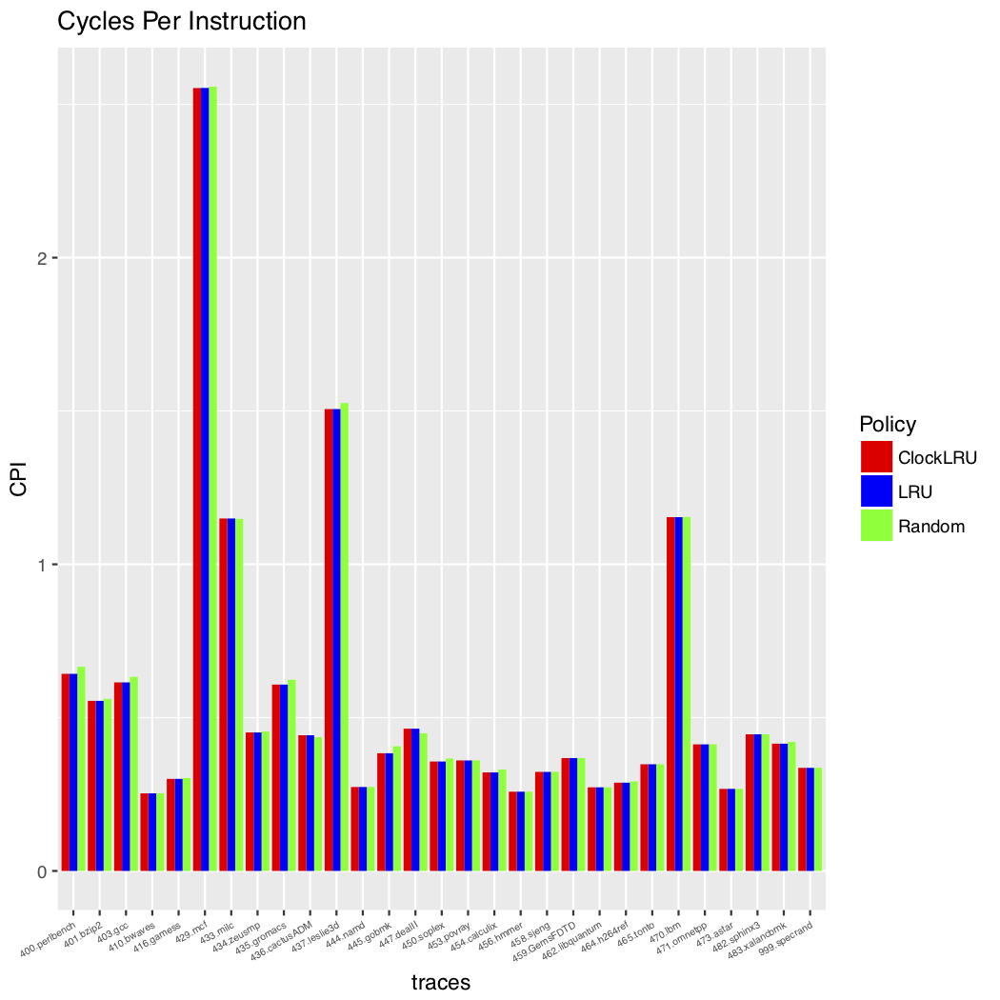
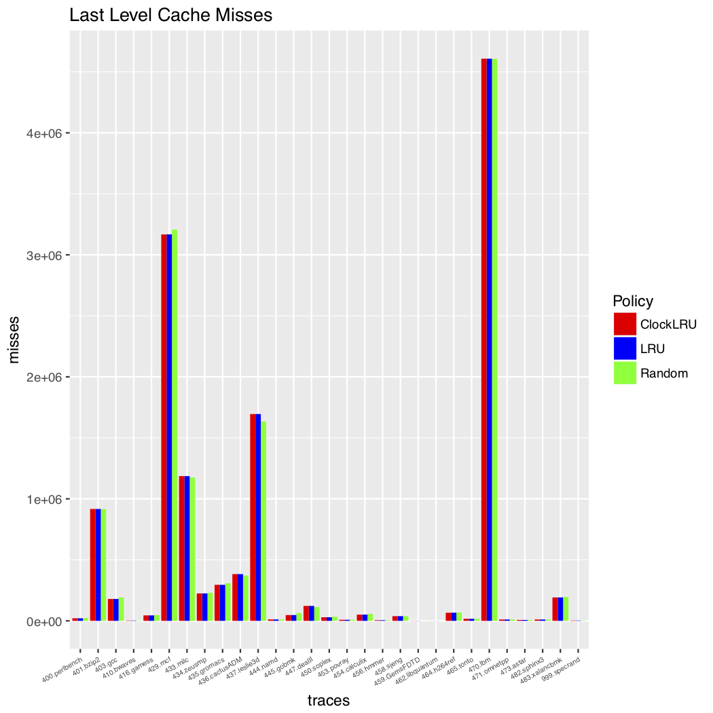

# 实验一：Cache替换策略的设计与分析

徐鉴劲 2015011313 计54 

## 已有的Cache替换策略

### LRU：最近未使用替换策略

LRU(Least Recent Used)核心思想是将最久的没有使用过的块替换出去。

原本应该是统计一下使用次数，将使用最少的cache块替换出去，但是由于实现比较复杂，一般使用上面所说的方法。

具体的实现可以使用一个栈，发生访问的时候，将栈中被访问的块的上面的块下移，再将这个块移到栈顶即可。发生替换的时候，将栈底的块替换出去。

### PLRU策略

PLRU(Pseudo-LRU)，核心思想是用较少的开销近似LRU。

一种基于二叉树的cache替换策略如下：

首先，cache内的所有块用二叉树表示。二叉树的路径就表示了一个被选中的cache块。二叉树的节点上（除了叶子结点是cache块）有一个bit表示路径是左子树还是柚子树。

然后，在发生访问的时候，指针沿着二叉树的路径向下，路途上的节点bit都被取反。

如果该位置上已有有块了，就把它替换出去。

### FIFO策略

最先进入cache的块最先被替换出去，其直觉来源于最早进入的块待的时间最久。

### LIFO策略

最先进入cache的块最后被替换出去。其直觉来源于：刚刚访问过的块，可能一段时间内并不需要了。

其实只需要记录上一次访问的块，然后发生替换的时候直接替换出这一个块即可。

### 随机替换策略

顾名思义，当发生替换的时候，随机选择一个目标进行替换。

它最大的优点是简单，缺点是会降低命中率。

### LFU策略

最近最常使用替换。

## 我的Cache策略替换：Clock-LRU

### 设计思路

我基于LRU的一种退化情况进行了改进，我叫做clock-LRU算法。

循环中的访问是周期性的，如果一个cache的最大容量可以容纳一个循环的量，在这里LRU可以很快地收敛到最佳结果。但是如果一个循环中的访问量大于cache的容量，那么有可能出现一种退化情况：LRU退化成FIFO。

我的改进基于以下观察：

在一个循环中存在以下访问：

1. a[0..1000]的访问。

2. a[0]+a[0]+a[0]的访问。

此时a[0]就是最远的，它会被替换掉，然而在后面它会被多次访问。这种情况下，LRU退化成了FIFO。由于我们假设是处于一个循环中，所以我们有可能知道a[0]曾经出现多次，我想要为LRU增加一种特例，使得他能够在这种情况下不退化成LRU。

我的做法是在LRU中增加一个量：clock数。

如果访问一个量的时候发现它正好处于栈顶，那么clock += 1。

如果要替换出去的块有大于1的clock数，那么我们应该将倒数第二块替换出去，同时将它的clock数减去1。

在这样策略的作用下，从第二次循环开始，a[0]就会常驻在cache块中，不会被替换出去。

### 核心代码

核心代码是`UpdateClockLRU`和`Get_ClockLRU_Victim`：

```C
INT32 CACHE_REPLACEMENT_STATE::Get_ClockLRU_Victim( UINT32 setIndex )
{
    // Get pointer to replacement state of current set
    LINE_REPLACEMENT_STATE *replSet = repl[ setIndex ];

    INT32   lruFirst   = 0;
    INT32   lruSecond  = 0;
    bool vic_first = true;

    // Search for victim whose stack position is assoc-1
    for(UINT32 way=0; way<assoc; way++) 
    {
        if( replSet[way].LRUstackposition == (assoc-1) ) 
        {
            lruFirst = way;
            if( replSet[way].ClockNum == 0 ) {
                // clock == 0: victim
                break;
            } else {
                // clock != 0: second as victim
                vic_first = false;
                replSet[way].ClockNum --;
            }
        }
        if( replSet[way].LRUstackposition == (assoc-2) ) 
        {
            lruSecond = way;
        }
    }

    if(vic_first) return lruFirst;
    
    // reset the second victim's clock
    replSet[lruSecond].ClockNum = 0;
    return lruSecond;
}
```

```C
void CACHE_REPLACEMENT_STATE::UpdateClockLRU( UINT32 setIndex, INT32 updateWayID )
{
    // Determine current LRU stack position
    UINT32 currLRUstackposition = repl[ setIndex ][ updateWayID ].LRUstackposition;

    if ( currLRUstackposition == 0 ) repl[ setIndex ][ updateWayID ].ClockNum ++;
    else {
        // Update the stack position of all lines before the current line
        // Update implies incremeting their stack positions by one
        for(UINT32 way=0; way<assoc; way++) 
        {
            if( repl[setIndex][way].LRUstackposition < currLRUstackposition ) 
            {
                repl[setIndex][way].LRUstackposition++;
            }
        }
    }

    // Set the LRU stack position of new line to be zero
    repl[ setIndex ][ updateWayID ].LRUstackposition = 0;
}
```

## 实验

时间结果如下图所示：






|替换策略/指标|CPI|LLC miss|miss rate %|
|:--|:--|:--|:--|
|LRU|0.5561|460272|64.629|
|Random|0.5603|460684|65.389|
|ClockLRU|0.5561|460254|64.627|

Random替换策略具有最高的miss rate，因而它的CPI是最多的，所以程序运行时间最长。

LRU替换策略具有最低的miss rate，它的CPI是最小的，程序的运行时间最短。

我对于LRU的改进还比较微小，可能是直接选第二个的策略太过于简单粗暴，每次clock只减去1也可能不符合实际情况。